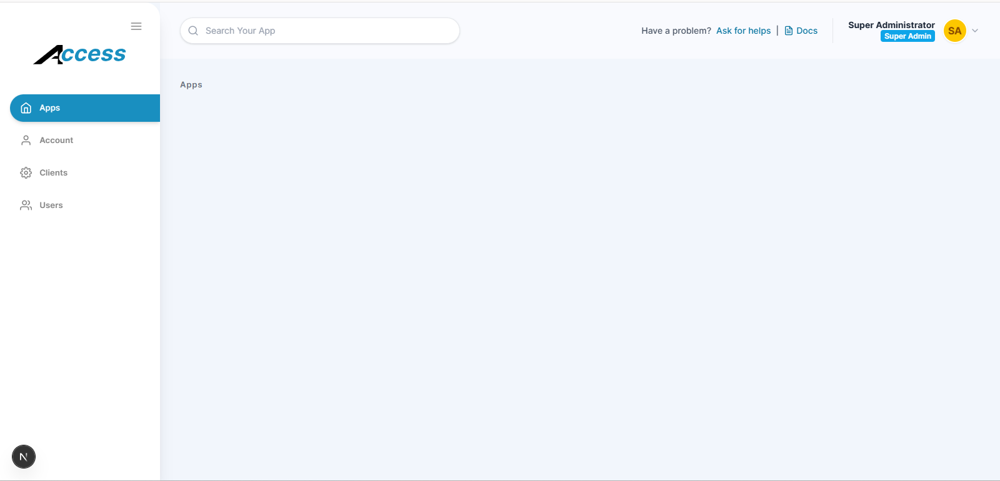

# SSO Access Project



## Setup Documentation

Follow these steps to get the project running locally.

### 🐳 Run with Docker Compose (Recommended)

The easiest way to run the entire project (Database, Redis, Backend, and Frontend) is using Docker Compose.

1. **Configure Environment Variables**:
   Copy the example environment files for both backend and frontend:
   ```bash
   cp golang/.env.example golang/.env
   cp next/.env.example next/.env
   ```

2. **Run the Project**:
   ```bash
   docker-compose up -d --build
   ```

3. **Access the Applications**:
   - Frontend: [http://localhost:3000](http://localhost:3000)
   - Backend API: `http://localhost:8080`

---

### Manual Setup (Without Docker)

#### Backend (Golang) Setup

1. **Create database named `access`**
   ```sql
   CREATE DATABASE access;
   ```
   ```
   cd golang
   go mod tidy
   ```
3. **Ensure Services are Running**: Make sure MySQL and Redis are already running on your machine.
4. **Environment Variables**: Copy `.env.example` to `.env` and fill in the actual values.
   ```bash
   cp .env.example .env
   ```
5. **Run Migrations**:
   ```bash
   make migrate
   ```
6. **Run Database Seeding**:
   ```bash
   make seed
   ```
7. **Start the Server** (using Air for hot reloading):
   ```bash
   air
   ```
   
`default username: super-admin`
`default password: very-secret`

### Frontend (Next.js) Setup

1. **Install dependencies**:
   ```bash
   cd next
   npm install
   ```
2. **Configure environment variables**:
   ```bash
   cp .env.example .env
   ```
   Fill in your `.env` file according to the following table:
   | Variable | Description | Example |
   |---|---|---|
   | `NEXT_PUBLIC_DEBUG` | Enables or disables debug mode in the frontend. | `true` |
   | `NEXT_PUBLIC_BASE_API_URL` | The base URL for the Golang backend API. | `http://localhost:8080` |
   | `NEXT_PUBLIC_OAUTH_AUTHORIZE_URL` | The OAuth authorization endpoint URL on the backend. | `http://localhost:8080/oauth/authorize` |
   | `NEXT_PUBLIC_CLIENT_ID` | The OAuth Client ID for the SSO System frontend. The backend seeder hardcodes this for easier development. | `sso-access-client-id-12345` |
   | `NEXT_PUBLIC_REDIRECT_URI` | The OAuth callback redirect URI for this frontend application. | `http://localhost:3000` |

3. **Run the development server**:
   Start the Next.js development server:
   ```bash
   npm run dev
   ```
   
The application will be available at [http://localhost:3000](http://localhost:3000).